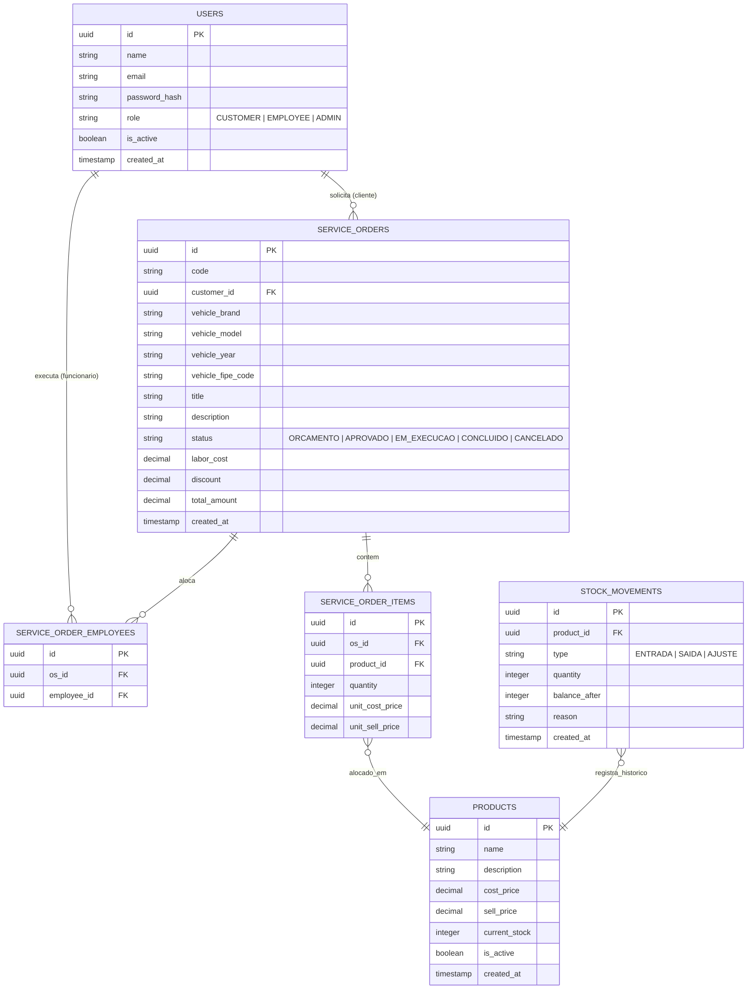

# 🚗 AutoCare ERP: Sistema de Gerenciamento de Oficina Mecânica

O **AutoCare ERP** é um sistema desenvolvido em Node.js projetado para automatizar, organizar e otimizar os processos operacionais e administrativos de oficinas mecânicas. O sistema contém os serviços de controle do estoque de produtos, abertura de Ordens de Serviço (OS), rastreabilidade de movimentações, consulta de dados automotivos oficiais e um dashboard de gestão empresarial.

---

## 📑 Sumário

- [🎯 Visão Geral do Sistema](#-visão-geral-do-sistema)
- [👤 Perfis de Acesso e Regras de Negócio](#-perfis-de-acesso-e-regras-de-negócio)
  - [1. Cliente (Usuário Comum: `CUSTOMER`)](#1-cliente-usuário-comum-customer)
  - [2. Funcionário (`EMPLOYEE`)](#2-funcionário-employee)
  - [3. Administrador (`ADMIN`)](#3-administrador-admin)
- [🌐 Integrações com APIs Externas](#-integrações-com-apis-externas)
  - [1. API Tabela FIPE](#1-api-tabela-fipe-httpsfipeapibr)
  - [2. Nodemailer](#2-nodemailer-httpsnodemailercom-serviço-de-e-mail)
- [🏗️ Arquitetura de Software e Estrutura de Pastas](#️-arquitetura-de-software-e-estrutura-de-pastas)
- [🗄️ Modelagem do Banco de Dados (DER)](#️-modelagem-do-banco-de-dados-der)
- [🛠️ Infraestrutura e Esteira DevOps (CI/CD)](#️-infraestrutura-e-esteira-devops-cicd)
- [🚀 Guia de Configuração e Execução](#-guia-de-configuração-e-execução)
  - [Pré-requisitos](#pré-requisitos)
  - [Passo 1: Clonar o Repositório](#passo-1-clonar-o-repositório)
  - [Passo 2: Configurar Variáveis de Ambiente](#passo-2-configurar-variáveis-de-ambiente)
  - [Passo 3: Executar a Aplicação via Docker Compose](#passo-3-executar-a-aplicação-via-docker-compose)
  - [Executando Testes Automatizados Localmente](#executando-testes-automatizados-localmente)
- [📬 Coleção de Requisições (Postman)](#-coleção-de-requisições-postman)

---

## 🎯 Visão Geral do Sistema

Oficinas mecânicas frequentemente enfrentam dificuldades para acompanhar o andamento dos consertos dos veículos, mostrar preços claros, controlar o estoque de peças e avaliar o trabalho da equipe. Com isso, para resolver esses problemas, o **AutoCare ERP** integra três pilares essenciais:

1. **Atendimento ao Cliente e Transparência:** Permite que o cliente acompanhe o histórioco e o status em tempo real de sua Ordem de Serviço (OS), recebendo um aviso assim que o conserto é finalizado.
2. **Operacional e Controle de Estoque:** Facilita o registro de peças, serviços e mecânicos responsáveis em cada atendimento, além de garantir que toda peça utilizada no conserto seja descontada do estoque automaticamente.
3. **Gestão e Controle Financeiro:** Oferece ao administrador um dashboard administrativo completo para acompanhar o faturamento, o lucro, o consumo de peças e o desempenho da equipe por período.

---

## 👤 Perfis de Acesso e Regras de Negócio

A aplicação utiliza controle de acesso baseado em papéis (Role-Based Access Control - RBAC) através de JSON Web Tokens (JWT), na qual os usuários são categorizados em três perfis estratégicos:

### 1. Cliente (Usuário Comum: `CUSTOMER`)
- **Ações Permitidas:** 
  - Criar seu próprio perfil no sistema com e-mail e senha.
  - Autenticar-se (Login/Logout) e solicitar redefinição de senha via e-mail.
  - Visualizar o histórico de suas próprias Ordens de Serviço, checando detalhes como título, descrição, status atual, preço de mão de obra, produtos aplicados, desconto concedido e valor total.
- **Regras de Negócio e Restrições:** 
  - O cliente possui acesso estritamente de leitura às suas Ordens de Serviço.
  - Não possui permissão para visualizar dados de outros clientes, movimentações de estoque global ou métricas operacionais.

### 2. Funcionário (`EMPLOYEE`)
- **Ações Permitidas:** 
  - Autenticar-se e redefinir sua própria senha.
  - Cadastrar clientes (caso o cliente prefira que a oficina faça o primeiro registro).
  - Criar, atualizar e gerenciar Ordens de Serviço (alterar status entre *ORCAMENTO*, *APROVADO*, *EM_EXECUCAO*, *CONCLUIDO*, *CANCELADO*).
  - Consultar dados da Tabela FIPE para preenchimento ágil e padronizado do veículo na OS.
  - Vincular peças e serviços às Ordens de Serviço e atribuir os mecânicos responsáveis.
  - Gerenciar produtos e cadastrar movimentações diretas no estoque.
- **Regras de Negócio e Restrições:** 
  - Um funcionário **não pode** criar contas de outros funcionários ou administradores.
  - Por razões de privacidade e segurança, quando o funcionário cria a conta de um cliente, ele não define a senha final, um fluxo de redefinição de senha por e-mail é disparado para que o próprio cliente crie suas credenciais.
  - Não possui acesso ao Dashboard Financeiro da administração.

### 3. Administrador (`ADMIN`)
- **Ações Permitidas:** 
  - Executar todas as funções permitidas aos funcionários e clientes.
  - Criar e gerenciar contas corporativas de novos funcionários e outros administradores.
  - Acessar o **Dashboard Administrativo**, que fornece métricas consolidadas:
    - Quantidade total e listagem de OSs por status.
    - Cálculo de receita bruta, custos e lucro ou déficit operacional.
    - Análise de produtividade filtrada por funcionário ou equipe.
    - Relatórios de consumo de produtos e estoque crítico.
- **Regras de Negócio e Restrições:** 
  - O perfil de Administrador é restrito.
  - Ao cadastrar um novo funcionário ou administrador, o sistema envia um e-mail de ativação para garantir que senhas padrão não fiquem expostas.

---

## 🌐 Integrações com APIs Externas

O projeto integra duas APIs externas essenciais para agregar valor real ao sistema:

### 1. API Tabela FIPE ([`https://fipe.api.br/`](https://fipe.api.br/))
- **Finalidade no Projeto:** Agilizar e padronizar o processo de abertura de Ordens de Serviço, evitando erros humanos no cadastro dos veículos na OS.
- **Como Funciona:** Durante o cadastro de uma nova OS, a API do AutoCare ERP realiza requisições para listar marcas, modelos e anos cadastrados na Tabela FIPE nacional, isso evita erros de digitação e garante ter modelos e marcas corretas para não ter erros da oficina automotiva na hora de comprar ou usar peças para atender a OS.

### 2. Nodemailer ([`https://nodemailer.com/`](https://nodemailer.com/)): Serviço de E-mail
- **Finalidade no Projeto:** Comunicação com os usuários para segurança e notificações operacionais.
- **Casos de Uso Integrados:**
  1. **Confirmação e Boas-vindas:** Envio de mensagem com instruções no momento da criação de contas.
  2. **Recuperação de Senha Segura:** Envio de tokens temporários e assinados para redefinição de credenciais.
  3. **Notificação de Conclusão de Serviço:** Quando uma Ordem de Serviço muda seu status para `CONCLUIDO`, o sistema dispara automaticamente um e-mail informando o cliente de que o veículo está pronto para retirada.

---

## 🏗️ Arquitetura de Software e Estrutura de Pastas

A aplicação foi desenhada seguindo os princípios da **Clean Architecture** (Arquitetura Limpa), dividindo as responsabilidades em camadas bem delimitadas para isolar as regras de negócio de detalhes de infraestrutura (como banco de dados, frameworks web e APIs externas).

```text
autocare-erp/
├── .github/                  # Pipelines de CI/CD (GitHub Actions)
├── database/                 # Scripts de Migrations e Seeds SQL
├── docs/                     # Coleções de API e documentações complementares
├── src/
│   ├── domain/               # [Camada Central] Regras de Negócio Puras
│   │   ├── entities/         # Entidades de negócio (User, ServiceOrder, Product, etc.)
│   │   └── errors/           # Erros customizados da aplicação
│   │
│   ├── use-cases/            # [Casos de Uso] Orquestração das regras de negócio
│   │   ├── auth/             # Casos de uso de autenticação e senha
│   │   ├── service-orders/   # Casos de uso de Ordens de Serviço
│   │   ├── stock/            # Casos de uso de estoque
│   │   └── dashboard/        # Casos de uso de relatórios analíticos
│   │
│   ├── adapters/             # [Adaptadores] Interface entre o mundo externo e os use cases
│   │   ├── controllers/      # Controladores HTTP que tratam requisições/respostas
│   │   └── presenters/       # Formatação e sanitização de dados de saída
│   │
│   └── infrastructure/       # [Infraestrutura] Frameworks, Bancos e Serviços
│       ├── database/         # Conexão com PostgreSQL via driver nativo 'pg'
│       ├── external-services/# Clientes de APIs externas (FIPE, Nodemailer)
│       ├── http/             # Servidor Express, Middlewares de Autenticação e Erros
│       └── repositories/     # Implementação concreta dos repositórios em SQL
│
├── tests/                    # Suíte de Testes Automatizados
│   ├── unit/                 # Testes unitários das entidades e use cases
│   └── integration/          # Testes de integração dos endpoints HTTP
│
├── .env.example              # Modelo de variáveis de ambiente
├── docker-compose.yml        # Orquestração do banco e da aplicação
├── Dockerfile                # Build otimizado em múltiplos estágios (Multi-stage)
├── package.json              # Dependências e scripts do projeto
└── README.md                 # Documentação principal do repositório
```

---

## 🗄️ Modelagem do Banco de Dados (DER)

A persistência de dados utiliza o banco relacional **PostgreSQL**, a qual foi modelada para garantir integridade referencial, rastreabilidade completa de histórico de estoque e alocação flexível de equipes de trabalho em Ordens de Serviço.




---

## 🛠️ Infraestrutura e Esteira DevOps (CI/CD)

O projeto também conta com um pipeline automatizado configurado via **GitHub Actions**:

1. **Lint e Testes:** Validação de estilo de código e execução da suíte de testes com Jest, garantindo cobertura superior a **70%**.
2. **Análise de Segredos:** Varredura automática para impedir credenciais ou tokens no código.
3. **Análise de Qualidade (SonarQube):** Verificação de segurança, vulnerabilidades e *code smells* através de Quality Gate.
4. **Segurança de Containers (Trivy):** Varredura de vulnerabilidades conhecidas na imagem Docker base e em pacotes.
5. **Build e Push de Container:** Construção da imagem utilizando **Dockerfile Multi-Stage Build** e envio para o repositório de imagem.
6. **Deploy Automatizado:** Deploy automático no ambiente de produção hospedado no **Render**.

---

## 🚀 Guia de Configuração e Execução

### Pré-requisitos
- **Docker e Docker Compose:** Instalados e operantes.

### Passo 1: Clonar o Repositório
```bash
git clone https://github.com/GUSTAVO-ALESSANDRO/erp-autoshop.git
cd erp-autoshop
```
Ou instalar o .zip do projeto dentro de [`https://github.com/GUSTAVO-ALESSANDRO/erp-autoshop`](https://github.com/GUSTAVO-ALESSANDRO/erp-autoshop)

### Passo 2: Configurar Variáveis de Ambiente
Crie o arquivo `.env` na raiz do projeto usando como base o modelo `.env.example`:
```bash
cp .env.example .env
```

Exemplo de conteúdo do `.env`:
```env
PORT=3000

# Configurações do PostgreSQL
DB_HOST=postgres
DB_PORT=5432
DB_USER=postgres
DB_PASSWORD=postgres
DB_NAME=autocare_db

# Autenticação e Segurança
JWT_SECRET=sua_chave_secreta_jwt_muito_segura
JWT_EXPIRES_IN=1d

# Serviço de E-mail (Nodemailer)
SMTP_HOST=smtp.mailtrap.io
SMTP_PORT=2525
SMTP_USER=seu_usuario_smtp
SMTP_PASS=sua_senha_smtp
SMTP_FROM=nao-responda@autocare.com.br
```

### Passo 3: Executar a Aplicação via Docker Compose
Para subir o banco de dados PostgreSQL e a aplicação Node.js em containers isolados, execute:
```bash
docker-compose up -d --build
```

A aplicação estará disponível e pronta para uso em `http://localhost:PORTA`.

### Executando Testes Automatizados Localmente
Para executar a suíte de testes unitários e de integração com relatório de cobertura:
```bash
npm test
```

---

## 📬 Coleção de Requisições (Postman)

Para facilitar a verificação e testes dos endpoints da API, o repositório contém uma coleção pronta para importação localizada no diretório `/docs`:

- **Caminho do arquivo:** `docs/autocare-postman-collection.json`
- **Como importar:**
  1. Abra o Postman.
  2. Clique em **Import** e selecione o arquivo `docs/autocare-postman-collection.json`.
  3. A coleção já inclui as variáveis de ambiente necessárias (como `{{baseUrl}}` e `{{authToken}}`) para testar o fluxo completo de autenticação, recuperação de senha, criação de ordens de serviço e consulta de estoque.